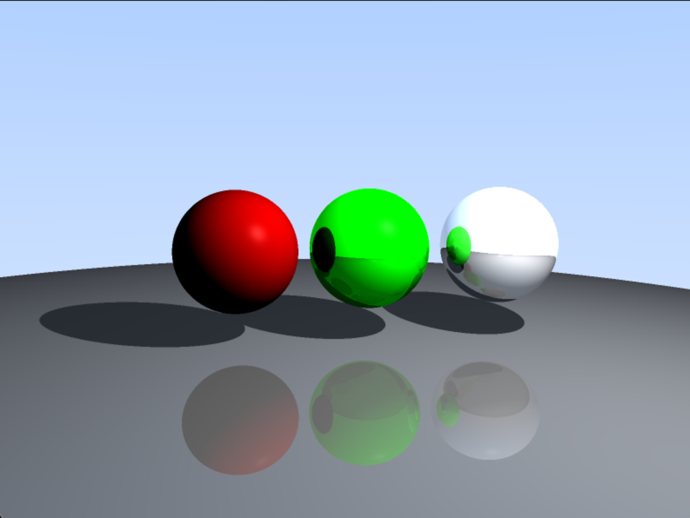

# GPU Ray Tracer with Metal Compute Shaders

Real-time ray tracer I built to for exploration and learning.
Started on CPU (got 3 FPS), moved to Metal compute shaders (now 60 FPS).



## Features

- Ray-traced reflections
- Hard shadows from point lights
- Basic Phong lighting (diffuse + specular)
- 4x anti-aliasing for smooth edges
- Interactive first-person camera

## How It Works

Each pixel gets its own thread on the GPU. The shader:
1. Generates a ray from the camera through that pixel
2. Tests if it hits any spheres (quadratic equation for ray-sphere intersection)
3. If it hits, calculates lighting and shoots shadow rays
4. If the surface is reflective, bounces and repeats

The tricky part was tracking energy loss correctly. Each bounce multiplies
the "throughput" by the surface color and reflectivity, so a green mirror
tints the reflected light green. Took me a while to understand why that
was the right approach.


## Technical Challenges

**Memory alignment**
Metal pads float3 to 16 bytes, but C++ glm::vec3 is 12 bytes. 
Had to debug why my camera FOV was reading as 0.0 - the GPU was reading from
the wrong memory location! Solution: use vec4 everywhere in shared structs.

**Camera math:**
Had the reflection formula right but was passing `currentRay.origin` instead
of `currentRay.direction` to the reflect function. Obvious in hindsight!

**FOV double-conversion:**
I was converting degrees to radians in C++, then Metal was treating the
result as degrees and converting again. Ended up with a FOV of 0.78 degrees
instead of 45 degrees - everything was zoomed in like crazy.

## What I Learned

- Metal compute shaders and how to dispatch threads
- CPU-GPU data transfer and memory alignment gotchas  
- The math behind ray-sphere intersection (discriminant, quadratic formula)
- How reflection and lighting stack together in a ray tracer
- Why iterative loops work better than recursion on GPUs

## Project Evolution

**Phase 1 (CPU Implementation):**
- Initial ray tracer running on CPU
- Achieved basic rendering but limited to ~3 FPS
- Single-threaded, no GPU acceleration

**Phase 2 (Metal Compute Shader Migration):**
- Ported ray tracing logic to Metal compute shaders
- Parallelized across 2M+ pixels (1920×1080)
- Achieved 60 FPS with multi-bounce reflections

**Phase 3 (Feature Expansion):**
- Added reflective materials with energy-based attenuation
- Implemented ray-traced shadows
- Added 4 sample anti-aliasing
- Implemented Phong specular highlights

## Build Instructions

### Requirements
- macOS 10.15+
- Xcode with Metal support
- CMake 3.15+
- OpenGL 3.3+

## Building

Requires macOS and Xcode. Standard CMake build:
```bash
mkdir build && cd build
cmake .. && cmake --build .
./ray_tracer
```

## Controls

- **WASD**: Move camera
- **Mouse**: Look around
- **Space/Tab**: Move up/down
- **Shift/Ctrl**: Adjust movement speed
- **R**: Reset camera
- **ESC**: Exit

## Next Steps

- [ ] Refraction for glass objects (have Snell's law working, need Fresnel)
- [ ] Texture mapping (want a checkerboard floor)
- [ ] More object types (currently just spheres)
- [ ] BVH acceleration structure for more complex scenes

## References

- [Ray Tracing in One Weekend](https://raytracing.github.io/) - Peter Shirley
- [Metal Shading Language Specification](https://developer.apple.com/metal/Metal-Shading-Language-Specification.pdf)
- [Physically Based Rendering](https://www.pbr-book.org/) - Matt Pharr et al.

**Developed by Lucas Weinstein | github.com/lucasbwein | linkedin.com/in/lucasweinstein**  
